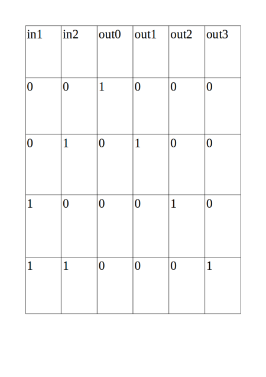
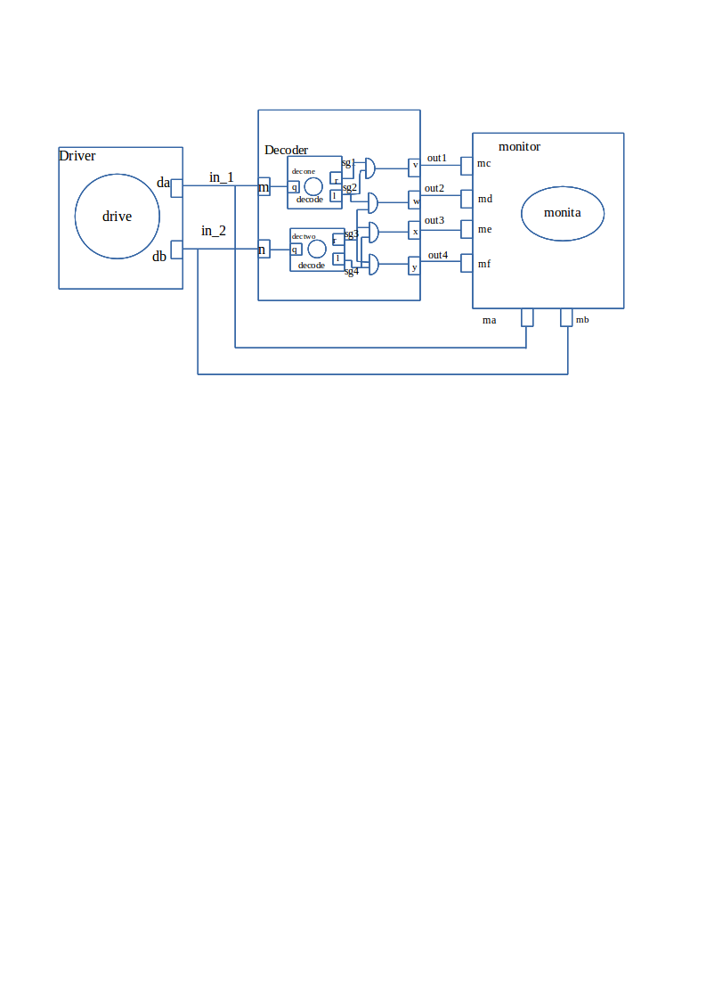
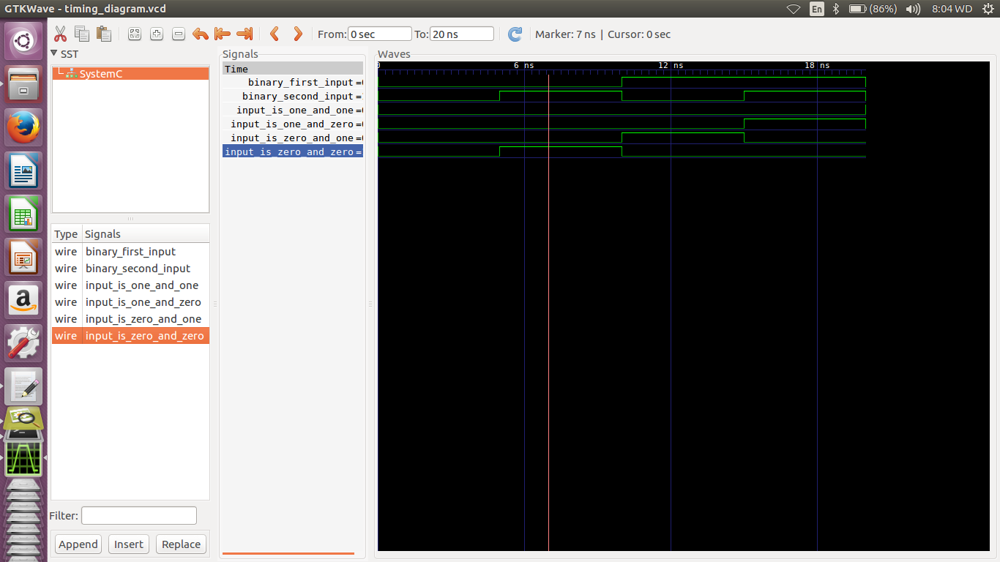

This is a 2-by-4 decoder example, which is a makefile project and so no need for an IDE. 
Just cd into this folder and run the command 

    make decoder

A line decoder is a device that changes the input code into a set of signals. 
It takes an n-digit binary number and decodes it into 2n data lines.
It does the reverse of encoding.  
In the following truth table, the output out1 is high when the inputs in1 and in2 are both 0, the output out1 is high when the input in1 is 0 and in2 is 1, the output out2 is high when the input in1 is 1 and in2 is 0, the output out3 is high when the input in1 is 1 and in2 is 1. It decodes a single digit binary number.
Only one signal is high(selected) when the right binary number is available on the input.  
Its truth table: 

  

###Circuit:

  

Model of computation:

  

Results:
The above MOC was implemented in systemc (code in this folder) and the following output found from traced signals. 
Traced signals timing diagram:

  

