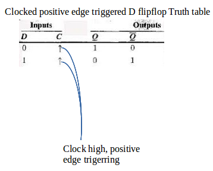
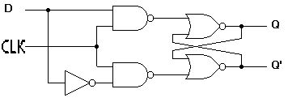
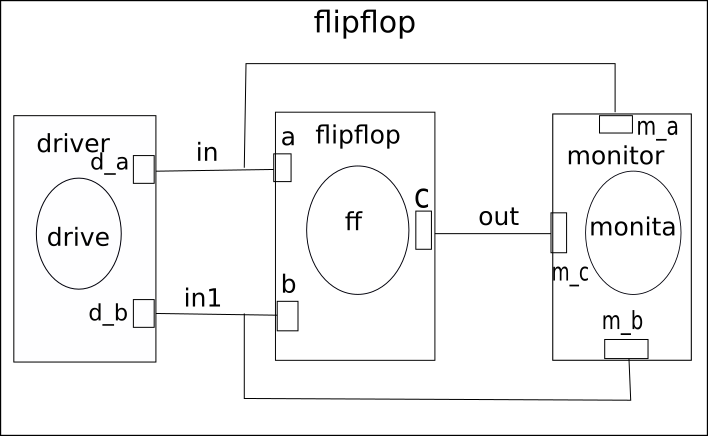
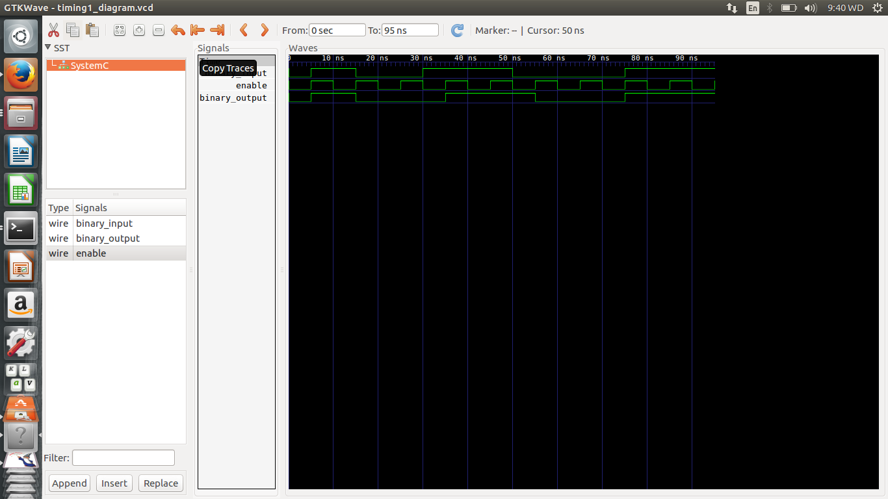

This is a D flipflop, which is a makefile project and so no need for an IDE. 
Just cd into this folder and run the command 

    make flop

This is a D flip-flop, also called a delay flip-flop, can be used to provide temporary storage of one bit of
information. 
When the clock is active, the data bit (0 or 1) present at the D input is transferred to
the output.In the D flip-flop of Fig. 10.39, the data transfer from D input to Q output occurs on
the negative-going (LOW-to-HIGH) transition of the clock input. The D input can acquire new status when the clock is inactive, which is the time period between successive LOW-to-HIGH transitions. 
The D flip-flop can provide a maximum delay of one clock period. 
Its truth table: 

  

###Circuit:

  

Model of computation:

  

Results:
The above MOC was implemented in systemc (code in this folder) and the following output found from traced signals. 
Traced signals timing diagram:

  

