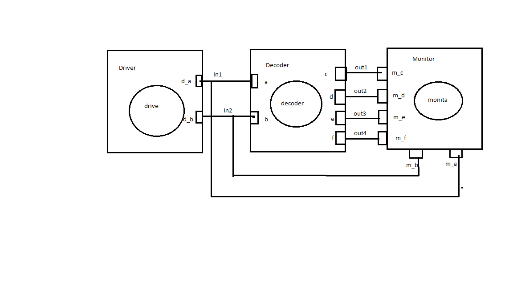

This is a 2-by-4 decoder example, which is a makefile project and so no need for an IDE. 
Just cd into this folder and run the command 

    make vyne

A line decoder is a device that changes the input code into a set of signals. 
It takes an n-digit binary number and decodes it into 2n data lines.
It does the reverse of encoding.  
In the following truth table, the output D0 is high when both inputs are zero,  the output D1 is high when the input A is 0 and input B is 1,  the output D2 is high when the input A is 1 and input B is 0,  the output D3 is high when both inputs are 1. it decodes a single digit binary number.
 
Its truth table: 

  

###Circuit:

Model of computation:

  

Results:
The above MOC was implemented in systemc (code in this folder) and the following output found from traced signals. 
Traced signals timing diagram:

  

Tutorial 2:
Create a decoder_2by4 based on this decoder_1by2. 
Reuse the systemc module for decoder_1by2 cascaded to build a more complex module for the decoder_2by4.
<em>Hint:</em> use additional and logic gates to determine the final outputs as in the truth table.
