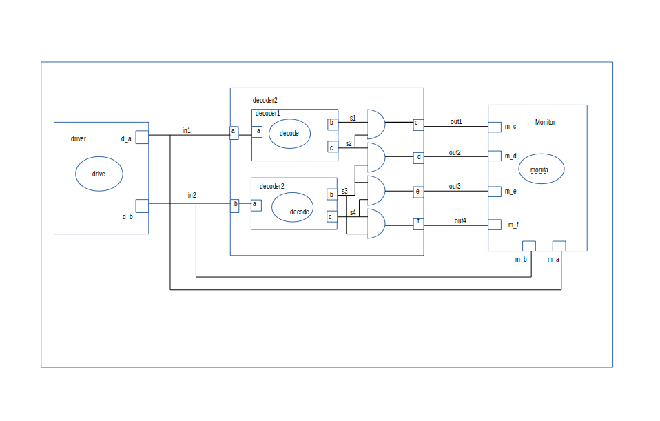

This is a 2-by-4 decoder, which is a makefile project.
Open terminal and cd into the folder containing these files for decoder_2by4 and run the following command " make decoder

2-by-4 decoder is a line decoder.
A line decoder is a device that changes the input code into a set of signals. 
It takes an n-digit binary number and decodes it into 4n data lines.
It does the reverse of encoding.  
In the following truth table, the output D0 is high when both inputs are zero,  the output D1 is high when the input A is 0 and input B is 1,  the output D2 is high when the input A is 1 and input B is 0,  the output D3 is high when both inputs are 1. it decodes a single digit binary number.
 
Its truth table: 

  

###Circuit:

  

Model of computation:

  

Results:
The above MOC was implemented in systemc (code in this folder) and the following output found from traced signals. 
Traced signals timing diagram:

  

