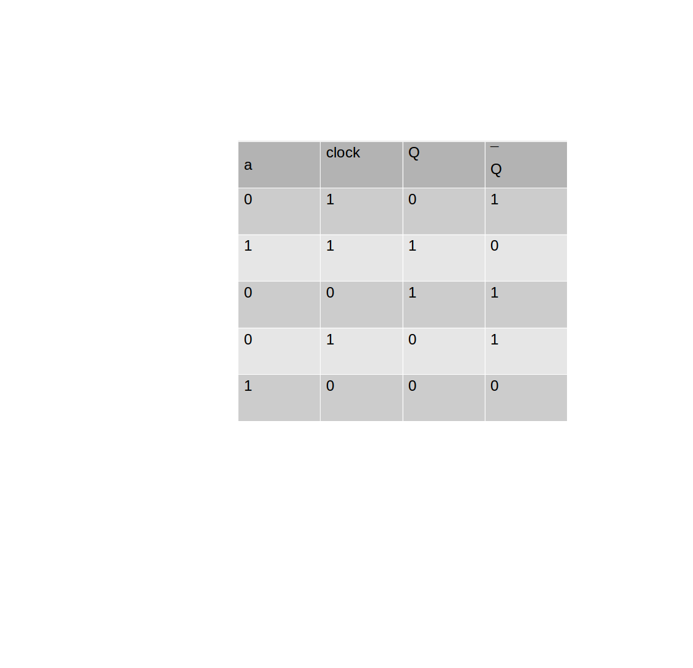
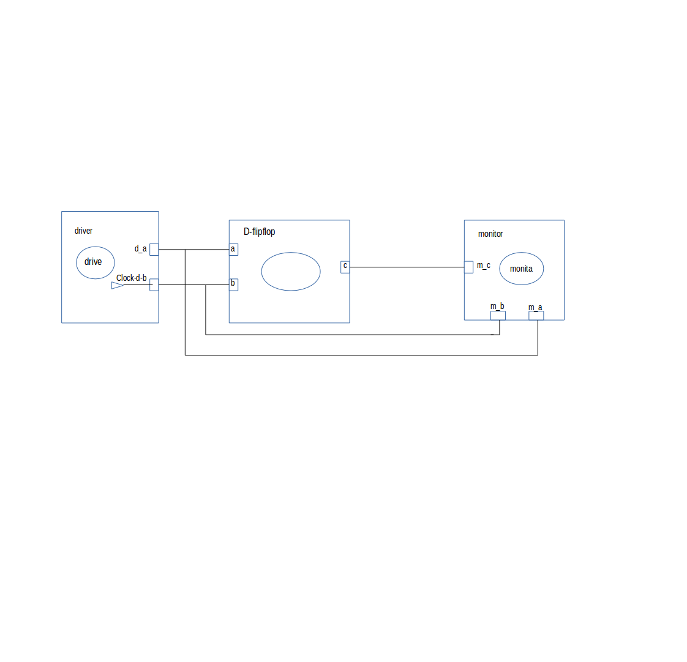
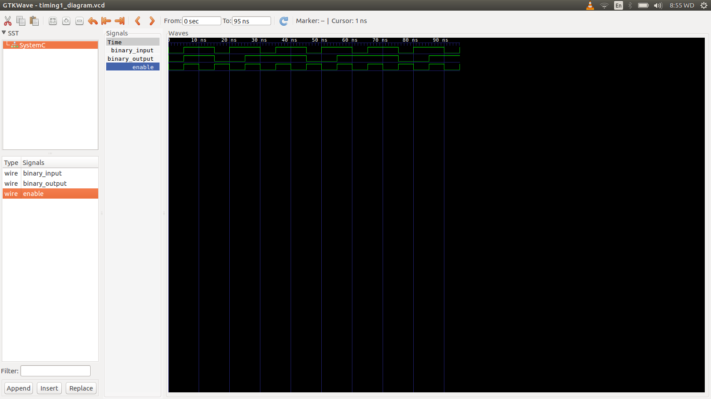

This is a D-latch flipflop, which is a makefile project and so no need for an IDE. 
Just cd into this folder and run the command 

    make Dflipflop

This is a D-latch flip-flop, also called a delay flip-flop, it temporary stores information. 
The input a takes two data bit that is 1 and 0,each at its own time.In the D-latch flipflop when the clock is enabled it reads the signal bit in the input terminal and outputs it.It moves on to store the data bit when in its inactive state until when its enabled  again where it reads the data bit in the input signal again and outputs the current signal,the system acts like a looping system.
The D-latch flipflop can provide a maximum delay of one clock period. 
Its truth table: 

  

Circuit:

  

Model of computation:

  

Results:
The above MOC was implemented in systemc (code in this folder) and the following output found from traced signals. 
Traced signals timing diagram:

  

